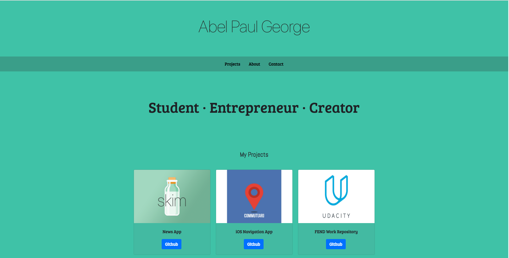

# Portfolio-Project
This is my first project in my Front End Developer Udacity Nanodegree. 

I created a unique Portfolio Website from scratch from a .pdf mockup and utilized HTML, CSS, Bootstrap, and Responsive Design.





### Prerequisites

HTML & CSS Crash Course 
https://github.com/abelpaul/Udacity-FEND-HTMLCSSReview

```
HTML
CSS
Responsive Design
Grid/Flexbox
Viewports
```


## Deployment
https://abelpaul.github.io/Portfolio-Project/

